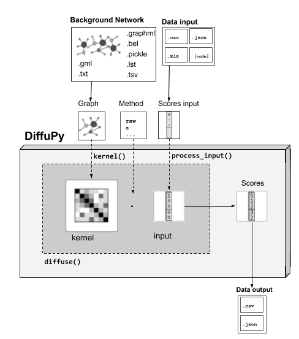

Basic Usage
~~~~~~~~~~~
The two required input elements to run diffusion using DiffuPy are:
 1) A **network/graph**. (see Network-Input Formatting below)
 2) A **dataset of scores**. (see Scores-Input Formatting below)

For its usability, you can either:

 - Use the `Command Line Interface (see cli) <https://github.com/multipaths/DiffuPy/blob/master/docs/source/cli.rst>`_.
 - Use *pythonically* the **functions** provided in *diffupy.diffuse*:

.. code-block:: python3

  from diffupy.diffuse import run_diffusion

  # DATA INPUT and GRAPH as PATHs -> returned as *PandasDataFrame*
  diffusion_scores = run_diffusion(~/data/input_scores.csv, ~/data/network.csv).as_pd_dataframe()

  # DATA INPUT and GRAPH as Python OBJECTS -> exported *as_csv*
  diffusion_scores = run_diffusion(input_scores, network).as_csv('~/output/diffusion_results.csv')

Methods
~~~~~~~
The diffusion method by default is *z*, which statistical normalization has previously shown to outperform.
Further parameters to adapt the propagation procedure are also provided, such as choosing from the available diffusion
methods or providing a custom method function. See `diffusion Methods and/or Method modularity
<https://github.com/multipaths/DiffuPy/blob/master/docs/source/diffusion.rst>`_.

.. code-block:: python3

  diffusion_scores_select_method = run_diffusion(input_scores, network, method = 'raw')

  from networkx import page_rank # Custom method function

  diffusion_scores_custom_method = run_diffusion(input_scores, network,  method = page_rank)

You can also provide your own kernel method or select among the ones provided in the *kernels.py* function which you can
provide as a *kernel_method* argument. By default *regularised_laplacian_kernel* is used.

.. code-block:: python3

  from diffupath.kernels import p_step_kernel # Custom kernel calculation function

  diffusion_scores_custom_kernel_method = run(input_scores, method = 'raw', kernel_method = p_step_kernel)

So *method* stands for the **diffusion process** method, and *kernel_method* for the **kernel calculation** method.

Formatting
----------

Before running diffusion algorithms on your network using DiffuPy, take into account the **graph and
input data/scores formats**. You can find specified here samples of supported input scores and networks.

Input format
~~~~~~~~~~~~~

The input is preprocessed and further mapped before the diffusion. See input mapping or `see process_input docs
<https://github.com/multipaths/DiffuPy/blob/master/docs/source/preprocessing.rst>`_ for further details. Here we
outline the input formats covered for its preprocessing.

Scores
--------
You can submit your dataset in any of the following formats:

- CSV (*.csv*)
- TSV (*.tsv*)
- *pandas.DataFrame*
- *List*
- *Dictionary*

(check Input dataset examples)

So you can **either** provide a **path** to a *.csv* or *.tsv* file:

.. code-block:: python3

  from diffupy.diffuse import run_diffusion

  diffusion_scores_from_file = run_diffusion('~/data/diffusion_scores.csv', network)

or **Pythonically** as a data structure as the *input_scores* parameter:

.. code-block:: python3

  data = {'Node':  ['A', 'B',...],
        'Node Type': ['Metabolite', 'Gene',...],
         ....
        }
  df = pd.DataFrame (data, columns = ['Node','Node Type',...])

  diffusion_scores_from_dict = run_diffusion(df, network)

Please ensure that the dataset minimally has a column 'Node' containing node IDs. You can also optionally add the
following columns to your dataset:

- NodeType
- LogFC [*]_
- p-value

.. [*] |Log| fold change

.. |Log| replace:: Log\ :sub:`2`

Networks
--------

If you would like to submit your own networks, please ensure they are in one of the following formats:

- BEL_ (.bel)

- CSV (.csv)

- Edge_ `list`__ (.lst)

- GML_ (.gml or .xml)

- GraphML_ (.graphml or .xml)

- Pickle (.pickle). BELGraph object from PyBEL_ 0.13.2

- TSV (.tsv)

- TXT (.txt)

.. _Edge: https://networkx.github.io/documentation/stable/reference/readwrite/edgelist.html
__ Edge_
.. _GraphML: http://graphml.graphdrawing.org
.. _BEL: https://language.bel.bio/
.. _GML: http://docs.yworks.com/yfiles/doc/developers-guide/gml.html
.. _PyBEL: https://github.com/pybel/pybel/

Minimally, please ensure each of the following columns are included in the network file you submit:

- Source
- Target

Optionally, you can choose to add a third column, "Relation" in your network (as in the example below). If the relation
between the **Source** and **Target** nodes is omitted, and/or if the directionality is ambiguous, either node can be
assigned as the **Source** or **Target**.

Kernel
--------
If you dispose of a precalculated kernel, you can provide directly the kernel object without needing to also provide a
graph object. As mentioned above, if you wish to use your kernel method function you can provide it as *kernel_method*
argument on the previous described functions:

Input dataset examples
~~~~~~~~~~~~~~~~~~~~~~

DiffuPath accepts several input formats which can be codified in different ways. See the
`diffusion scores <https://github.com/multipaths/DiffuPy/blob/master/docs/source/diffusion.rst>`_ summary for more
details on how the labels input are treated according each available method.

**1.** You can provide a dataset with a column 'Node' containing node IDs.

+------------+
|     Node   |
+============+
|      A     |
+------------+
|      B     |
+------------+
|      C     |
+------------+
|      D     |
+------------+

.. code-block:: python3

  from diffupy.diffuse import run_diffusion

  diffusion_scores = run_diffusion(dataframe_nodes, network)

Also as a list of nodes:

.. code-block:: python3

  ['A', 'B', 'C', 'D']

.. code-block:: python3

  diffusion_scores = run_diffusion(['A', 'B', 'C', 'D'], network)

**2.** You can also provide a dataset with a column 'Node' containing node IDs as well as a column 'NodeType',
indicating the entity type of the node to run diffusion by entity type.

+------------+--------------+
|     Node   |   NodeType   |
+============+==============+
|      A     |     Gene     |
+------------+--------------+
|      B     |     Gene     |
+------------+--------------+
|      C     |  Metabolite  |
+------------+--------------+
|      D     |    Gene      |
+------------+--------------+

Also as a dictionary of type:list of nodes :

.. code-block:: python3

  {'Gene': ['A', 'B', 'D'], 'Metabolite': ['C']}

.. code-block:: python3

  diffusion_scores = run_diffusion({'Genes': ['A', 'B', 'D'], 'Metabolites': ['C']}, network)

**3.** You can also choose to provide a dataset with a column 'Node' containing node IDs as well as a column 'logFC'
with their logFC. You may also add a 'NodeType' column to run diffusion by entity type.

+--------------+------------+
| Node         |   LogFC    |
+==============+============+
|      A       | 4          |
+--------------+------------+
|      B       | -1         |
+--------------+------------+
|      C       | 1.5        |
+--------------+------------+
|      D       | 3          |
+--------------+------------+

Also as a dictionary of node:score_value :

.. code-block:: python3

  {'A':-1, 'B':-1, 'C':1.5, 'D':4}

.. code-block:: python3

  diffusion_scores = run_diffusion({'A':-1, 'B':-1, 'C':1.5, 'D':4})

Combining point 2., you can also indicating the node type:

+--------------+------------+--------------+
| Node         |   LogFC    |   NodeType   |
+==============+============+==============+
|      A       | 4          |     Gene     |
+--------------+------------+--------------+
|      B       | -1         |     Gene     |
+--------------+------------+--------------+
|      C       | 1.5        |  Metabolite  |
+--------------+------------+--------------+
|      D       | 3          |    Gene      |
+--------------+------------+--------------+

Also as a dictionary of type:node:score_value :

.. code-block:: python3

  {Gene: {A:-1, B:-1, D:4}, Metabolite: {C:1.5}}

  diffusion_scores = run_diffusion({Gene: {A:-1, B:-1, D:4}, Metabolite: {C:1.5}}, network)

**4.** Finally, you can provide a dataset with a column 'Node' containing node IDs, a column 'logFC' with their logFC
and a column 'p-value' with adjusted p-values. You may also add a 'NodeType' column to run diffusion by entity type.

+--------------+------------+---------+
| Node         |   LogFC    | p-value |
+==============+============+=========+
|      A       | 4          | 0.03    |
+--------------+------------+---------+
|      B       | -1         | 0.05    |
+--------------+------------+---------+
|      C       | 1.5        | 0.001   |
+--------------+------------+---------+
|      D       | 3          | 0.07    |
+--------------+------------+---------+

This only accepted pythonicaly in dataaframe format.

See the `sample datasets <https://github.com/multipaths/DiffuPy/tree/master/examples/datasets>`_ directory for example
files.

Custom-network example
~~~~~~~~~~~~~~~~~~~~~~

+-----------+--------------+-------------+
|  Source   |   Target     |  Relation   |
+===========+==============+=============+
|     A     |      B       | Increase    |
+-----------+--------------+-------------+
|     B     |      C       | Association |
+-----------+--------------+-------------+
|     A     |      D       | Association |
+-----------+--------------+-------------+

You can also take a look at our `sample networks <https://github.com/multipaths/DiffuPy/tree/master/examples/networks>`_
folder for some examples.

Input Mapping/Coverage
~~~~~~~~~~~~~~~~~~~~~~
Even though it is not relevant for the input user usage, taking into account the input mapped entities over the
background network is relevant for the diffusion process assessment, since the coverage of the input implies the actual
entities-scores that are being diffused. In other words, only the entities whose labels match an entity in the network
will be further processed for diffusion.

Running diffusion will report the mapping as follows:

.. code-block:: RST

   Mapping descriptive statistics

   wikipathways:
   gene_nodes  (474, 0.1538961038961039)
   mirna_nodes  (2, 0.046511627906976744)
   metabolite_nodes  (12, 0.75)
   bp_nodes  (1, 0.004464285714285714)
   total  (489, 0.14540588760035683)

   kegg:
   gene_nodes  (1041, 0.337987012987013)
   mirna_nodes  (3, 0.06976744186046512)
   metabolite_nodes  (6, 0.375)
   bp_nodes  (12, 0.05357142857142857)
   total  (1062, 0.3157894736842105)

   reactome:
   gene_nodes  (709, 0.2301948051948052)
   mirna_nodes  (1, 0.023255813953488372)
   metabolite_nodes  (6, 0.375)
   total  (716, 0.22809812042051608)

   total:
   gene_nodes  (1461, 0.4344335414808207)
   mirna_nodes  (4, 0.0011894142134998512)
   metabolite_nodes  (13, 0.003865596193874517)
   bp_nodes  (13, 0.003865596193874517)
   total  (1491, 0.4433541480820696)

To graphically see the mapping coverage, you can also plot a `heatmap view of the mapping (see views)
<https://github.com/multipaths/DiffuPath/blob/master/docs/source/views.rst>`_. To see how the mapping is performed over
an input pipeline preprocessing, take a look at this `Jupyter Notebook
<https://nbviewer.jupyter.org/github/multipaths/Results/blob/master/notebooks/processing_datasets/dataset_1.ipynb>`_
or `see process_input docs <https://github.com/multipaths/DiffuPy/blob/master/docs/source/preprocessing.rst>`_
in DiffuPy.

Output format
~~~~~~~~~~~~~
The returned format is a custom *Matrix* type, with node labels as rows and a column with the diffusion score, which can
be exported into the following formats:

.. code-block:: python3

  diffusion_scores.to_dict()
  diffusion_scores.as_pd_dataframe()
  diffusion_scores.as_csv()
  diffusion_scores.to_nx_graph()
